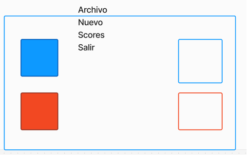

# Práctico 1 - Juego ordenar

El practico debe presentarse el 27 de agosto de 2024

## Interfaz

Se trata de programar un juego.
El menu tiene 3 opciones:

* Nuevo: Crea un tablero como en la figura donde el usuario puede 
mover cada cuadrado hasta su lugar. El
programa CALCULA el tiempo que le toma en 
milisegundos.
* Scores: Cuando el usuario logra colocar ambos
cuadrados en su lugar, entonces se calcula
el score como la cantidad de tiempo que le tomo.
Esta cantidad se anade a la lista de scores
del programa. Esta opcion mostrara esta lista EN ORDEN
ASCENDENTE.
* Salir: solamente sale del programa

## Patrones de diseno
Se debe utilizar el patron de diseno observer
y MVC. El modelo seria el juego con los
dos cuadrados.
