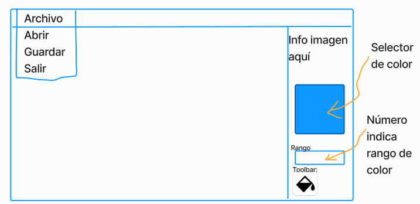
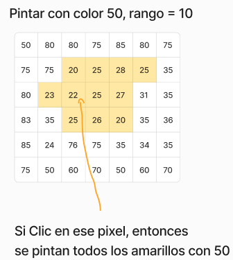

# Práctico 2 - Aplicacion Imagen

Se debe implementar una aplicación que muestre una imagen
y permita al usuario realizar las siguientes operaciones:

* Cargar una imagen
* Guardar una imagen
* Rellenar la imagen con un color

## Interfaz gráfica

La interfaz gráfica de la aplicación debe ser similar
a la que se ve en el gráfico a continuación:

Esta interfaz debe tener un panel a la derecha donde se 
pueden elegir los colores, el rango de colores y la 
herramienta para pintar.

## Patrones de diseño
La aplicación maneja un modelo que es la imagen y este
modelo debe estar dentro de un patrón Observer para 
mostrar la imagen en la vista.

Todo debe tener logs.

## Algoritmo de la herramienta de llenado
El algoritmo a implementar es el de Floodfill. Pero le
haremos una mejora importante para que nuestro 
programa sea un poco mas inteligente.

Para que pueda suceder lo que se indica en la figura el 
algoritmo es mas o menos asi:

1. El usuario hace clic en un pixel de la imagen
2. El usuario ya seleccionó el color 50 
3. Pixel es 50? 
4. Si es 50 entonces return; 
5. Tenemos pixel de referencia? 
6. Si no tenemos pintamos con 50 y marcamos como 22 el color de referencia; 
7. Llamamos al metodo al pixel de NSWE (norte, sur, oeste, este), es decir a la recurrencia, y return;
8. Si el color del pixel esta dentro de pixel de referencia más rango, entonces pintarlo con 50.
9. Llamamos al metodo al pixel de NSWE

## Entrega
La entrega debe ser el martes 10 de septiembre con las
reglas generales del curso.